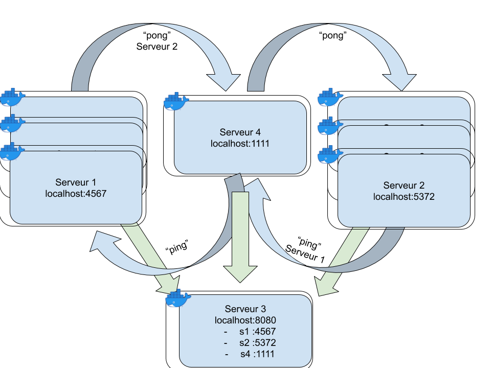
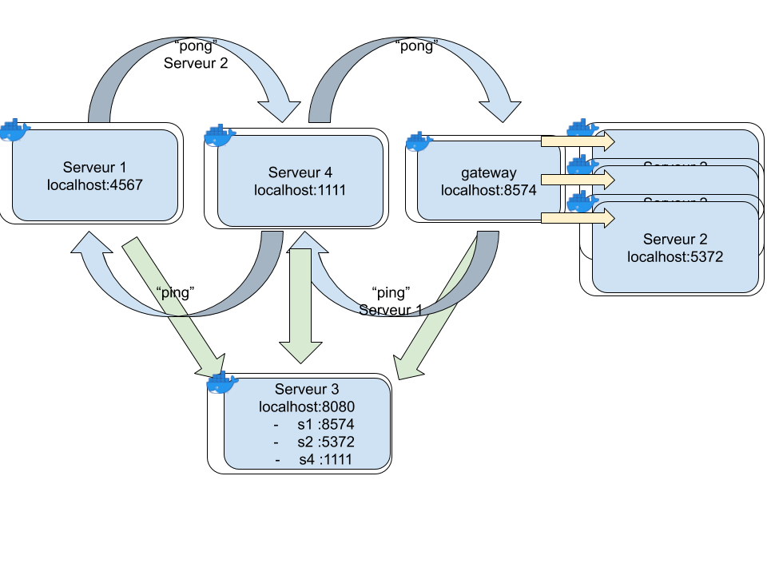

# Automatisation de Docker

Dans ces exercices on va réutiliser le code écrit dans le sujet précédent.
(Pensez à bien commit chaque exercice.)

## Exercice 1 : Docker compose

Pour commencer on veut automatiser le lancement de tous les container créé précédemment.
Pour ça on va utiliser docker-compose.

1. Ecrire un ficher docker-compose.yml qui permet de lancer tous les serveurs d'un seul coup avec la commande `docker-compose up`

## Exercice 2 : Mise à l'échelle

Docker-compose permet de lancer plusieurs fois la même instance d'un container.

1. Modifier le fichier docker-compose pour lancer 3 instances des serveurs "ping" et "pong".
   (Ils doivent continuer à communiquer entre eux).

2. On veut maintenant que chaque serveur (ping-1, ping-2, pong-1, pong-2) ne communique qu'avec son alter-ego (ping-1 à pong-1, ping-2 à pong-2).

## Exercice 3 : Gateway

1. Modifier le fichier docker-compose pour lancer 3 instances du serveur "ping" mais seulement une instance de "pong".

On veux maintenant que le serveur envoie "pong" au serveur "ping" chacun leurs tours. Mais on ne veut pas modifier le code du serveur car il pourrait y avoir un nombre arbitraire de serveur "ping".

2. Créer un serveur gateway qui envoie son adresse au serveur 3 et qui doit retransmettre le message aux serveurs "ping" chacun leurs tours.

Sécurité
On voudrait ajouter une couche de sécurité, qui isolerait les instances de serveurs 2 pour qu'il n'accepte de requêtes seulement de la gateway.

3. Modifier les réseaux pour seulement connecter les serveurs 2 à la gateway. La gateway devra continuer à répondre aux requêtes du serveur 4.

